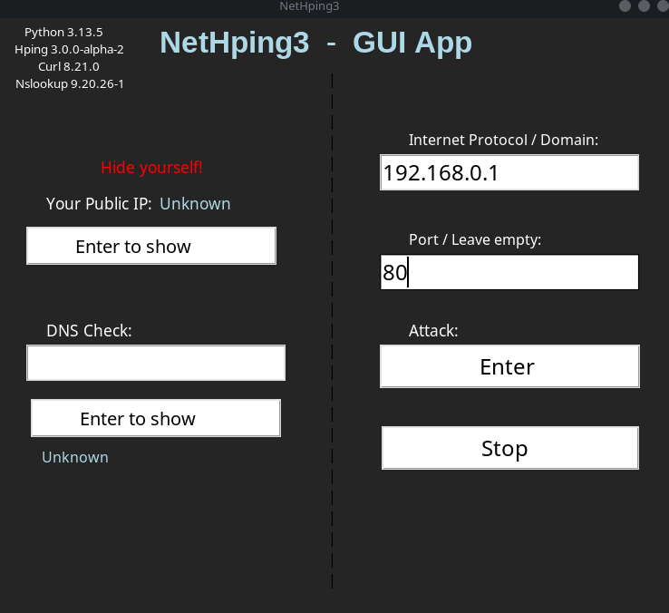
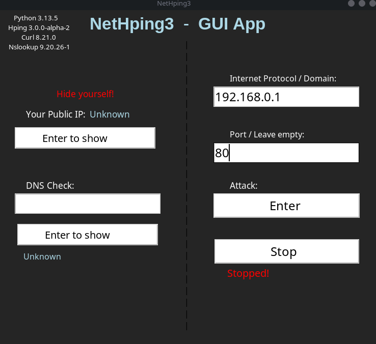

# NetHping3

**NetHping3 is a Python3 GUI App Tool / Script that automate an Denial-Of-Service Attack using Hping3.**

**This tool is developed on Debian Based Distribution.**

# Requirements

1. Python3 | apt install python3

2. OS Based on the Linux Kernel.

3. Hping3 | apt install hping3

4. Curl | apt install curl

5. Nslookup | apt install nslookup

# Installation / Usage

1. Clone the Repository
```bash
git clone https://github.com/KimDev-V/NetHping3.git
```
2. On X11, allow the root user to access the local display by running:
```bash
xhost +local:root
```
3. Finally, go in the Repository, using:
```bash
cd NetHping3
```
Then launch the App by:
```bash
sudo python3 Nethping3.py
```
After using it, be sure to remove the root user access from the local display:
```bash
xhost -local:root
```
# Screenshots





# - - - - - - - - - - - - - - - - - - - - - - - - - - - - - - - - - - - - - -

# ⚠️ Disclaimer ⚠️

***Use this software at your own risk. The author is not responsible for any damage, data loss, or misuse.***
